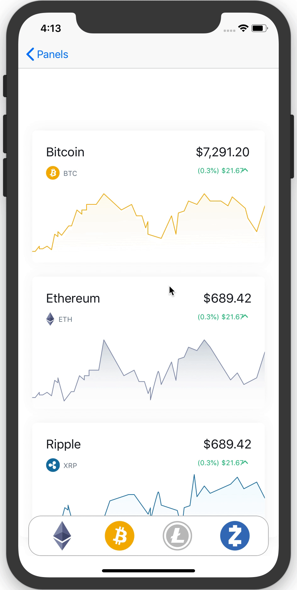
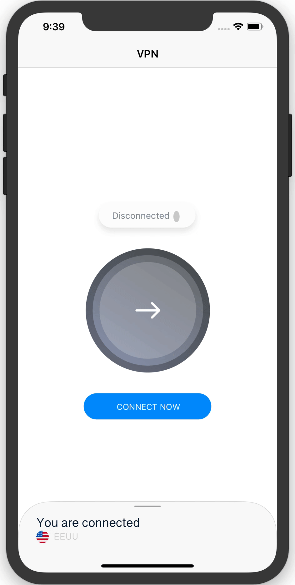

<p align="center">
  
</p>

[](https://travis-ci.org/antoniocasero/Panels)
[](https://github.com/Carthage/Carthage)
[](https://github.com/antoniocasero/Panels)
[](https://developer.apple.com/iphone/index.action)
[](https://developer.apple.com/swift)

[](http://twitter.com/acaserop)


Panels is a framework to easily add sliding panels to your application.
It takes care of the safe area in new devices and moving your panel when the keyboard
is presented/dismissed.

Updated to Swift 4.2

<p align="center">
    
    
    
</p>

## Usage

First, create your own panel, you can use Interface Builder, use as reference the examples provided.
Make sure that you conform the protocol `Panelable`

```swift
import UIKit
import Panels

class PanelOptions: UIViewController, Panelable {
    @IBOutlet var headerHeight: NSLayoutConstraint!
    @IBOutlet var headerPanel: UIView!
}
```
This protocol defines the interface needed to be able to adjust the sliding panel
to the container, expanding and collapsing. It will take care of the safe area


Then in your  ViewController, where the panel is presented:

```swift
class YourViewController: UIViewController {
    lazy var panelManager = Panels(target: self)
    override func viewDidLoad() {
        super.viewDidLoad()
        let panel = UIStoryboard.instantiatePanel(identifier: "YourPanelName")
        let panelConfiguration = PanelConfiguration(size: .oneThird)
        
        // To present the panel
        panelManager.show(panel: panel, config: panelConfiguration)
        ....
        // To dismiss the panel
        panelManager.dismiss()
    }
}

```

If you want to get notifications when the panel is presented, collapsed or
expanded, just conform the protocol `PanelNotifications`

You can find extra options in the `PanelConfiguration` object:

```swift
    /// Storyboard name, the first Viewcontroller will be instantiated
    public var panelName: String

    /// Panel height
    public var panelSize: PanelDimensions

    /// Panel margins between the header and the next views.
    public var panelMargin: CGFloat

    /// Visible area when the panel is collapsed
    public var panelVisibleArea: CGFloat

    /// Safe area is avoided if this flag is true.
    public var useSafeArea = true

    /// Collapse and expand when tapping the header view.
    public var respondToTap = true

    /// Collapse and expand when dragging the header view.
    public var respondToDrag = true

    /// Collapse when tapping outside the panel
    public var closeOutsideTap = true

    /// Animate the panel when the superview is shown.
    public var animateEntry = false

    /// If parent view is a navigationcontroller child, this flag allow a better calculation when the panelSize is .fullScreen
    public var enclosedNavigationBar = true
```

You could add an arrow indicator to give more feedback to your panels. The perfect companion for `Panels` is [Arrows](https://github.com/antoniocasero/Arrows)

<p align="center">
    
</p>


## Installation

### CocoaPods
Add the line `pod "Panels"` to your `Podfile`

### Carthage
Add the line `github "antoniocasero/Panels"` to your `Cartfile`

## Author
Project created by Antonio Casero ([@acaserop](https://twitter.com/acaserop) on Twitter).

## Credits
Sketch UI ([Elements](https://sketchapp.com/elements))
